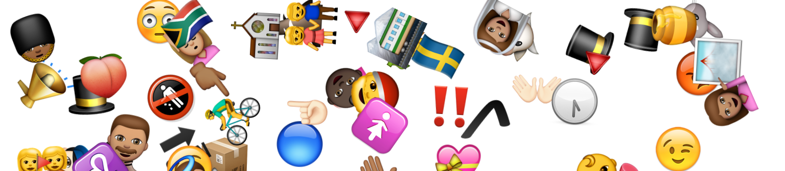

# emojify



a silly function for populating the screen with emoji. plays well with [animate.css](https://daneden.github.io/animate.css/)

tip: add `z-index:9999;` to your animation class

### emojify(cssAnimationClass, #toGenerate, Size)
Can handle multiple classes. generating a lot of emojis will significantly slow down the browser. Max size = 125
```html

<script type="text/javascript">

button.addEventListener('click', function(){
  // emojify('animated hinge infinite', 20, 50);
  emojify('spin', 100, 50);

});
</script>

```